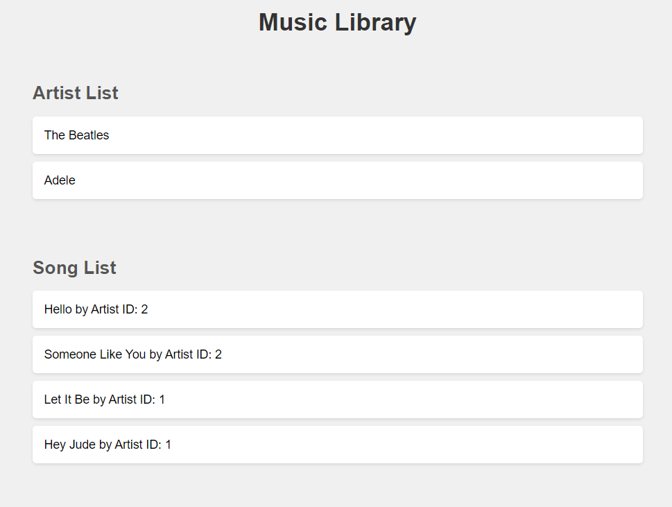

# Music Library Management API

This project is a Music Library Management API, developed using Node.js, Express, Sequelize as the ORM, and PostgreSQL as the database. The API allows users to manage a collection of artists and their songs. It provides endpoints to create, read, update, and delete (CRUD) both artists and songs, as well as retrieve songs by a specific artist. The project also includes a React-based frontend for an intuitive user interface, enabling easy interaction with the music library data.

🎧 Music Library API

This repository features an API dedicated to the organization and management of a music library. The backend is powered by Node.js, with Express serving as the framework, Sequelize functioning as the ORM, and PostgreSQL as the underlying database.

🛠️ Key Technologies

🟩 Node.js: JavaScript runtime built for scalable network applications.

🌍 Express: Minimalist web application framework for Node.js.

🔄 Sequelize: ORM that simplifies database interactions.

🐘 PostgreSQL: Advanced open-source relational database system.

🛠️ DBeaver: Multi-platform database tool for management and administration.

📝 Morgan: HTTP request logger middleware for Node.js.

📡 pg: PostgreSQL client for Node.js, enabling communication with the database.

🔄 pg-hstore: Assists in handling PostgreSQL’s hstore data format.

🚀 Nodemon: Automatically restarts the server upon detecting changes.# api-bd-david-echenagucia# api-bd-david-echenagucia
# davidleon220-api-bd-david-echenagucia
